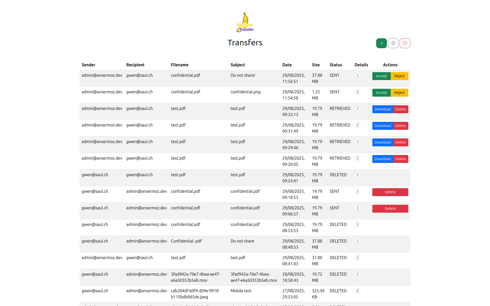
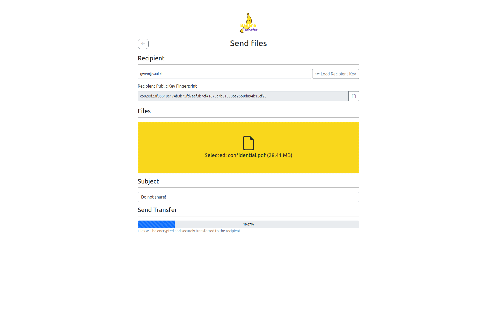
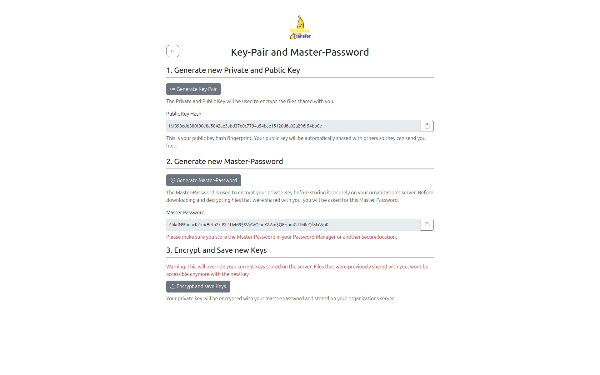
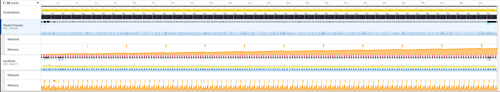

<div align="center">
  
</div>

# BananaTransfer

## Decentralized Secure File Sharing with End-to-End Encryption
Despite the rise of cloud-based file sharing platforms like SwissTransfer, and WeTransfer, or even some services trying to offer better security features like Tresorit, there remains a gap in the market for a truly decentralized, secure, and user-controlled file sharing solution. Existing services often rely on centralized infrastructure, exposing users to risks around privacy, data ownership, and single points of failure. **BananaTransfer** addresses these limitations by introducing an innovative approach allowing users to share files securely and privately, without depending on intermediaries or centralized servers. **BananaTransfer** is the most secure way to share files with your team, featuring end-to-end encrypted architecture and complete transparency via open-source code. Your files are encrypted before they leave your device - your data remains yours and you don't rely on cloud providers' servers to transfer and store your data.

## Features
- End-to-End Encryption: Files are protected with AES-256 encryption and RSA-4096 key exchange—security standards trusted by banks and governments. Even BananaTransfer can’t access your files.
- Self-Managed Security: You control your encryption keys. Your master password never leaves your device.
- Open Source: No black boxes, no hidden backdoors. Host your own server for full control.
- Cross-Platform: Access BananaTransfer from any device, anywhere. No downloads required.
- Enterprise Federation: Share files securely between organizations while maintaining end-to-end encryption.
- Intuitive & Fast: Secure file sharing is as easy as email. Onboard your team in minutes.

## How It Works

1. Create Your Account: Sign up with your organization’s BananaTransfer server. Registration takes less than 5 minutes!
2. Generate Your Keys: Automatic RSA-4096 key generation in your browser. Your keys and master password never leave your device.
3. Share Files: Drag, drop, and share files instantly. Files are encrypted before upload, recipients are notified immediately.
4. Receive & Download: Access shared files from any device, anywhere, anytime. Files decrypt automatically upon download.

## Screenshots

### Transfer list



### New transfer



### Key management



## Hosted version

While development of the application is in progress, we have deployed two BananaTransfer instances that you can try at: 
* [https://bananatransfer.saul.ch/](https://bananatransfer.saul.ch/) 
* [https://bananatransfer.ansermoz.dev/](https://bananatransfer.ansermoz.dev/)

## Limitations

Currently due to issues in the memory management and the availability of the File System API on Firefox, the app
only support large file transfer on Chrome based browser.

### Memory management issue during upload

As you can see in the following picture, the page parent process does not release the memory between uploaded chunk,
which lead to browser crashing during large transfer. On Chrome based browser, the memory is correctly released after 
each uploaded chunk which is coherent with our code. Therefore, we think the issue on Firefox is outside our control, 
and we could not find a workaround.



### File System API

During upload, all browser offer an API that allow us to read a file chunk by chunk. But during download, we need
the File System API to be able to write those chunk directly to disk. And this API is not available on all browser. 
Not being able to use it forces us to read the whole file in memory before writing it on disk which make 
large file download impossible. This is why we only support large file retrieval on Chrome based browser.

## Mockups

We have created mockups of the app's interface, which you can find in this repository in the [mockups](https://github.com/BananaTransfer/BananaTransfer/tree/main/documents/mockups/digital) folder.

## Project guide/contribute

If you're interested in contributing to BananaTransfer, you are very welcome ! To get familiar with the project structure and understand how you can get involved, take a look at our [work process](https://github.com/BananaTransfer/BananaTransfer/blob/main/documents/work_process.md). It also outlines how our core team collaborates on a day-to-day basis.

## License

This project is licensed under the [MIT License](LICENSE).

## Meet the team

We are a core team of four bachelor’s students from [HEIG-VD](https://heig-vd.ch/):

| Gwenaël Ansermoz | Glodi Domingos | Dominik Saul | Maxime Schaller |
|:-----------------|:---------------|:-------------|:----------------|
| Data Engineering | IT Security | IT Security | Data Engineering |

## Support

Any questions? [Open an issue](https://github.com/BananaTransfer/BananaTransfer/issues)

## Install and run the App

### Prerequisites

#### Install Node.js

Make sure to have Node.js 22 installed on the machine.

To install it, the version manager nvm can be used:

```bash
nvm install 22
nvm use 22
```

```bash
# or install it manually
curl -fsSL https://deb.nodesource.com/setup_22.x | sudo -E bash -
sudo apt-get install -y nodejs
```

#### Install Docker and Docker-Compose

Make sure you have Docker and Docker-Compose installed on your machine.

### Setup and install the App

Setup the project git hooks:

```bash
make setup
```

Install the required dependencies:

```bash
npm install
```

### Create configuration file

Create file `.env` with the configuration variables

```txt
# .env
# Environment configuration
PORT=3000
# NODE_ENV=dev

# Application configuration
DOMAIN=domain.com
JWT_SECRET=DO_NOT_USE_THIS_VALUE_IN_PRODUCTION_USE_256BIT_KEY

# Database configuration
DB_HOST=localhost
DB_PORT=5432
DB_USER=bananatransfer_user
DB_PASS=bananatransfer_password
DB_NAME=bananatransfer

# S3 configuration
S3_ENDPOINT=http://localhost:9000
S3_REGION=eu-west-1
S3_CLIENT_ID=minio_user
S3_CLIENT_SECRET=minio_password
S3_BUCKET=bananatransfer

## For use with docker compose only
S3_PORT=9000
S3_MANAGEMENT_PORT=9001

# Transfer expiration configuration
TRANSFER_EXPIRY_CREATED_HOURS=24
TRANSFER_EXPIRY_DAYS=30
TRANSFER_LOG_EXPIRY_DAYS=60
```

### Build the frontend
Build the frontend and copy the bootstrap and htmx files into public

```bash
npm run build
```

### Start and setup the Docker infrastructure

Start the local docker infrastructure with:

```bash
docker compose up 
```

Once the DB is started, you need to execute the migration with

```bash
npm run migration:run
```

### Start the App

Then you can run the app (in prod mode) with

```bash
# production mode
npm run start:prod
```

The app will be available on: http://localhost:3000

## Run the App locally in development mode

Make sure you did all the steps from the prevous chapter `Install and run the App`

Instead of running the app in the prod mode you can then run the app in the watch mode to watch any modification and rebuild and restart the server and frontend automatically:

```bash
# watch mode
npm run start:dev
```

The app will be available on: http://localhost:3000

### Commands for running the tests locally

```bash
# run linter to check errors
npm run lint

# unit tests
npm run test

# e2e tests
npm run test:e2e

# test coverage
npm run test:cov
```

### Commands concerning the database and database migration

```bash
# test db connection manually
npx tsx src/database/connection-checker.ts

# generate a new migration
npm run migration:generate src/database/migrations/<name>

# run migrations scripts
# (this will run all the ones that haven't been run yet)
npm run migration:run
```

### Run two servers locally for testing the communication between servers

You can run two instances of the application locally for testing purposes. This can be useful for testing communication between servers.

#### Create configuration file for serverB

You need to create a .env file for the second server instance: `.env.serverB`:
the following parameters need to be changed compared to the first server instance:

```txt
PORT=3001
DOMAIN=<use a different domain>
DB_PORT=5433
S3_ENDPOINT=http://localhost:10000
S3_PORT=10000
S3_MANAGEMENT_PORT=10001
```

In both env files the parameter `NODE_ENV=dev` needs to be set.
Set in both env files the parameter `OTHER_SERVER` to point to the other server instance. `OTHER_SERVER=localhost:3001`
`OTHER_SERVER=localhost:3000`

#### Setup and start both instances

```bash
# Install dotenv-cli globally
npm install -g dotenv-cli

# Start the docker compose for the first instance normally
docker compose up

# Start the docker compose for the second instance
docker compose --env-file .env.serverB -p server_b up

# Run the db migration on first db
npm run migration:run

# Run the db migration on second db
npm run migration:run:serverB

# Start the first server instance:
npm run start:dev

# Start the second server instance:
npm run start:dev:serverB
```

## Resources

Check out a few resources that may come in handy when working with NestJS:

- Visit the [NestJS Documentation](https://docs.nestjs.com) to learn more about the framework.
- For questions and support, please visit our [Discord channel](https://discord.gg/G7Qnnhy).
- To dive deeper and get more hands-on experience, check out our official video [courses](https://courses.nestjs.com/).
- Deploy your application to AWS with the help of [NestJS Mau](https://mau.nestjs.com) in just a few clicks.
- Visualize your application graph and interact with the NestJS application in real-time using [NestJS Devtools](https://devtools.nestjs.com).
- Need help with your project (part-time to full-time)? Check out our official [enterprise support](https://enterprise.nestjs.com).
- To stay in the loop and get updates, follow us on [X](https://x.com/nestframework) and [LinkedIn](https://linkedin.com/company/nestjs).
- Looking for a job, or have a job to offer? Check out our official [Jobs board](https://jobs.nestjs.com).
