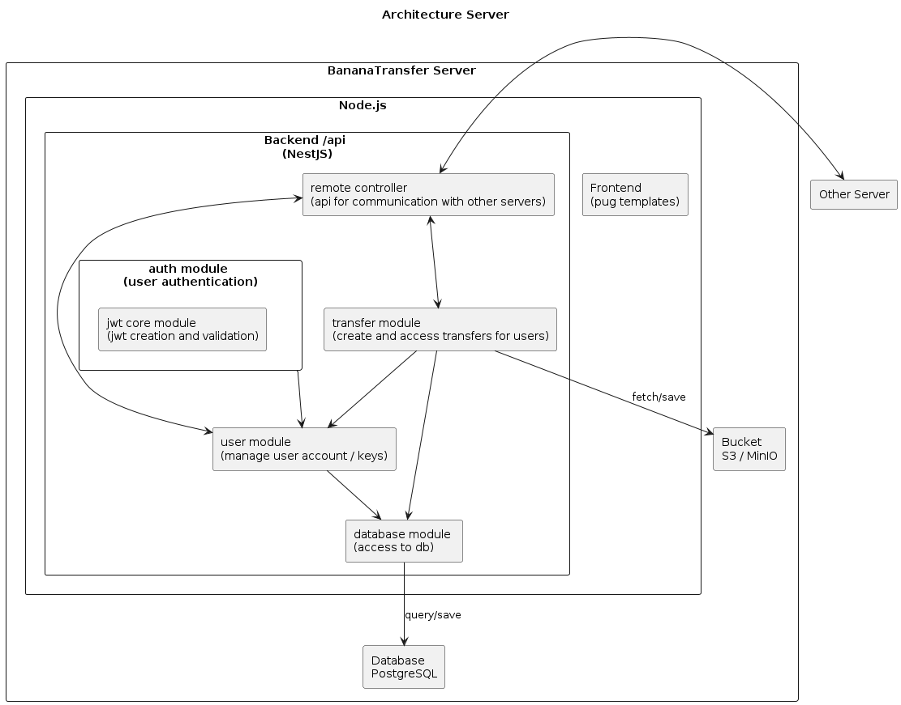

# System and Architecture Description

The developed product is a decentralized and end-to-end encrypted file sharing solution. Every organization/entity/domain may have their own servers. The servers are referred in the DNS zone of the domain.
A server does have a Web-interface for their users, with a DB and server to store the encrypted files that are being about to be send or were received.

## Architecture and Tech-Stack

* Web-server with server-side rendering
  * Node.js with the Nest.js framework
  * pug as a templating engine
  * HTMX to simplify the HTTP requests directly in the HTML
  * Bootstrap for the css/formatting
* Database to store app information
  * PostgreSQL
* File server (S3)
* (DNS)

## Hosting

Our code, project, docker images and CI/CD is hosted on github.com.
With the github action the code is then directly deployed to AWS.

## System Description and Logic

The private key generation, its encryption and decryption of the files directly happens in the browser using Web Crypto API.

### Create User Keys

The user can generate their private keys in the web-console of the server of their organization. 

The generation of the key directly happens in the browser. The generated private key is a RSA 4096-bit key.

This is achieved by generating an extractable CryptoKeyPair object which only exist in the browser environment.

The private key is then encrypted with a 64-char master-password before stored on the server. 
The user will store the master-password to decrypt the private key in his password vault.

To encrypt the private key, we use PBKDF2 as a key derivation function to derive an AES256-GCM symmetric key 
from the master-password (with SHA-256 as the hashing algorithm, 32 bytes for the salt and 100'000 iterations). 
The symmetric key is then used to encrypt the private key with AES256-GCM. 

The encrypted private key and the public keys are exported and stored in the server database with the WrapKey method
to ensure that the private key isn't available in plaintext in the browser memory. 
The private key and CryptoKeyPair object are then cleared from the browser memory.

### Send File

When sending the file the user first specifies the recipient.
The browser will then communicate with the server of the users organization to fetch the public key of the recipient and
check if the public key is a trusted recipient key of the user. (If not yet trusted the user has to confirm it).

After receiving the public key value, a hash is created with the method digest and then the key is turn into a CryptoKey object via the method importKey to be able to use it. 

The hash of the public key stored in the DB in the table TrustedRecipients is a SHA-256 hash of the recipients public key.

Then the user can add the file to send in its browser. The file is then directly encrypted in the Browser of the user using the Web Crypto API.
To encrypt the file the browser first generates a random AES256-GCM key and uses it to encrypt the file symmetrically.
The symmetric key, used to encrypt the file, is then encrypted with the public key of the recipient using RSA-OAEP.
The symmetric CryptoKey is then cleaned from memory.

### Get File

A user that receives a shared file first needs to accept it. 
When accepting the transfer their server fetches the file from the remote server, if it wasn't send locally.

The encrypted file and the encrypted private key of the user is then downloaded to the browser of the user. 
After the user enters their master-password to derive the symmetric key to decrypt their private key with the unwrapKey method, 
the private key can be used to decrypt the symmetric key (RSA-OAEP). 
As in the sending process the Web Crypto API is used for the decryption.
With the decrypted symmetric key the browser then decrypts the file itself (using AES256-GCM) and lets the user to download the file to the computer.

### Communication between two servers of different organizations

When a user sends a transfer to an user of another organization, the file is first uploaded to the server of the sender organization and the recipient server is notified about the transfer. As soon as the recipient accepts the transfer, their server fetches the encrypted file from the sender server.

All communication between the servers is done via HTTPS. The servers verify the TLS certificate of the other server if it corresponds to the hostname of the server.
To find the server of the recipient organization, the sender server uses the DNS to resolve the domain of the recipient organization:
To configure BananaTransfer for a domain, the DNS zone of the domain needs to have a TXT record with the name `_bananatransfer.domain.com` and with the hostname of the server that is hosting the BananaTransfer service for that domain. This hostname is then resolved with an additional DNS request to find the IP address of the server.

For example: if the sender `user1@domainsender.com` wants to send a file to `user2@domainrecipient.com`, the following steps are taken:

* The sender server of ansermoz.dev first resolves the DNS TXT record `_bananatransfer.domainrecipient.com` to find the hostname of the BananaTransfer server for the domain `domainrecipient.com`. The hostname found in the TXT record is for example `bt.domainrecipient.com`.
* The sender server then sends a DNS request to resolve the hostname `bt.domainrecipient.com` to an IP address.
* The server of `bt.domainrecipient.com` is then contacted via HTTPS. The TLS certificate of the server is verified to correspond to the hostname.

On any incoming connection from another server, the same verification is done:

* The TLS certificate of the incoming connection is verified to correspond to the hostname of the server.
* The recipient server looks up the DNS TXT record for the indicated domain `domainsender.com` to find the hostname of the BananaTransfer server for that domain. (f.ex. `srvbt.domainsender.com`).
* The hostname is resolved to an IP address and the file is fetched from the sender server.
* The hostname and IP address is then used to check if it corresponds to the hostname and IP from which the request was received, to prevent spoofing attacks.

### Further explanations about the System and Architecture choices

* AES256-GCM ensures the authenticity and integrity of the encrypted file and the content. We choose that a file share isn't additionally signed by the sender user with a asymmetric private key. To implement a signature of the transfer, every user would need an an additional key pair to sign the files they send, since it is not a best practice to use the same key pairs for encryption and signing. An asymmetric signature of the files would add a lot of complexity to the system without adding a real benefit in security, since to verify the signature we would need to fetch the public key of the sender from the same server as we already received the encrypted file.
* The Web Crypto API is used to encrypt and decrypt the files and keys in the browser. It is a standard API that is supported by all major browsers. It provides a secure way to perform cryptographic operations in the browser.
* The algorithms AES256-GCM, RSA-OAEP, SHA-256 and PBKDF2 are used for encryption, decryption, hashing and key derivation. They are widely used and considered secure. They are supported by the Web Crypto API in the browser.
* The private key is generated in the browser and encrypted with a master-password before stored on the server. This ensures that the private key is not stored in plain text on the server and can only be decrypted by the user who knows the master-password.
* A hash of the public key of a recipient is stored in the database of the sender server to detect modifications of the public key of the recipient and to remember the recipients of a user.
* The logs for share transfer are stored in the databases of the servers. They contain for example information about the status changes of a transfer and by who it was done.
* In the application config file it is possible to configure after how many days a transfer expires (by default 30 days, file is deleted but information and logs about transfer are kept) and after how many days the information and logs about a transfer are deleted from the database (by default 90 days).
* In the first version of the application, the logic to be able to blocklist an user or a whole domain for one user or the whole organization on a server is not implemented. It is possible to implement this in a future version of the application. However this feature would require additional logic and menus in the application for the users to access and manage their blocklist. Additionally, it would require to implement user permissions to manage who can manage the blocklist for the whole organization.

### Security Cnsiderations

* Browsers should be up-to-date
* Should be used exclusively with HTTPS

### Server/Code Architecture

