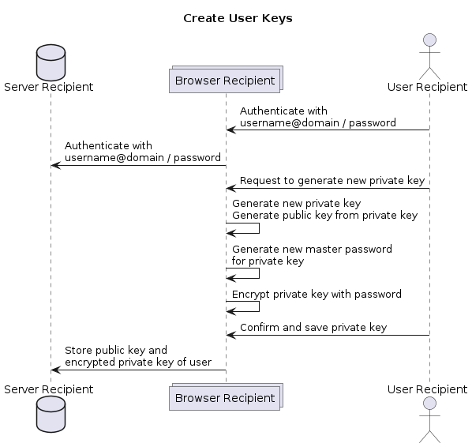

# System and Architecture Description

The developed product is a decentralized and end-to-end encrypted file sharing solution. Every organization/entity/domain may have their own servers. The servers are referred in the DNS zone of the domain.
A server does have a Web-interface for their users, with a DB and server to store the encrypted files that are being about to be send or were received.

## Architecture and Tech-Stack

* Web-server with server-side rendering
  * Node.js with the Nest.js framework
  * pug as a templating engine
  * HTMX to simplify the HTTP requests directly in the HTML
  * Bootstrap for the css/formatting
* Database to store app information
  * PostgreSQL
* File server (S3)
* (DNS)

## Hosting

Our code, project, docker images and CI/CD is hosted on github.com.
With the github action the code is then directly deployed to AWS.

## System Description and Logic

The private key generation and its , encryption and decryption of the files directly happens in the browser.

### Create User Keys

The user can generate their private keys in the web-console of the server of their organization. The generation of the key directly happens in the browser. The generated private key is a RSA 4096-bit key.
The private key is then encrypted with a 64-char master-password before stored on the server. The user will store the master-password to decrypt the private key in his password vault.

### Send File

When sending the file the user first specifies the recipient.
The browser will then communicate with the server of the users organization to fetch the public key of the recipient and check if the public key is a trusted recipient key of the user. (If not yet trusted the user has to confirm it).

The hash of the public key stored in the DB in the table TrusedRecipients is a SHA-256 hash of the recipients public key.

Then the user can add the file to send in its browser. The file is then directly encrypted in the Browser of the user using the Web Crypto API.
To encrypt the file the browser first generates a random AES-256 key and uses AES-GCM to encrypt the file symmetrically.
The symmetric key, used to encrypt the file, is then encrypted with the public key of the recipient using RSA-OAEP.

### Get File

A user that receives a shared file first needs to accept it. When accepting the transfer their server fetches the file from the remote server, if it wasn't send locally.

The encrypted file and the encrypted private key of the user is then downloaded to the browser of the user. After the user enters their master-password for the private key, the private key can be used to decrypt the symmetric key (RSA-OAEP). As in the sending process the Web Crypto API is used for the decryption.
With the decrypted symmetric key the browser then decrypts the file itself (using AES-GCM) and lets the user to download the file to the computer.

### Further explanations about the System and Architecture choices

* AES-GCM ensures the authenticity and integrity of the encrypted file and the content. We choose that a file share isn't additionally signed by the sender user with a asymmetric private key. To implement a signature of the transfer, every user would need an an additional key pair to sign the files they send, since it is not a best practice to use the same key pairs for encryption and signing. An asymmetric signature of the files would add a lot of complexity to the system without adding a real benefit in security, since to verify the signature we would need to fetch the public key of the sender from the same server as we already received the encrypted file.
* The Web Crypto API is used to encrypt and decrypt the files and keys in the browser. It is a standard API that is supported by all major browsers. It provides a secure way to perform cryptographic operations in the browser.
* AES-GCM and RSA-OEAP are used for encryption and decryption of the files and keys. Both algorithms are widely used and considered secure. They are supported by the Web Crypto API in the browser.
* The private key is generated in the browser and encrypted with a master-password before stored on the server. This ensures that the private key is not stored in plain text on the server and can only be decrypted by the user who knows the master-password.
* A hash of the public key of a recipient is stored in the database of the sender server to detect modifications of the public key of the recipient and to remember the recipients of a user.