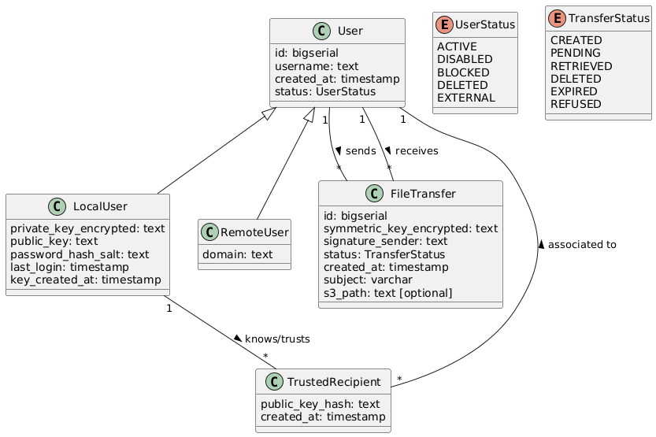

# Database

## Schema

### Definitions

* local transfer: transfer from one local user to another
* orphaned row: row not referenced from anywhere 

### key considerations

* a user may receive a transfer from another user they don't know or trust yet.
* a user may trust another user, but not with the same associated public key.
* when a local user rotate it's keys, the hash of the public key changes, changed but the previous one is kept until orphaned.
* in the TransferLog table, the history and logs of a transfer are saved to be able to track the transfer and its status.

#### TransferStatus descriptions

* CREATED: Sender created the transfer but didn't already uploaded the file yet
* UPLOADED: Sender created the transfer and uploaded the file to their server. The remote server wasn't yet notified about it
* SENT: The recipient server was notified about the file but the transfer wasn't accepted yet by the recipient
* ACCEPTED: Recipient accepted the transfer, but the file wasn't fetched yet from the remote server
* RETRIEVED: Status of the transfer when recipient accepted the transfer and the file is fetched on the server
* DELETED: File was deleted by sender or recipient
* REFUSED: Transfer was refused by recipient
* EXPIRED: Transfer has expired, f.ex. because recipient has changed its keys

### TransferStatus rules

* a sender can delete a remote transfer when it has the status CREATED, UPLOADED or SENT
* a remote sender server isn't informed when the recipient accepts, rejects, deletes or downloads the file
* the remote server will get requests to download the chunks from the recipient server and a confirmation of the recipient server if the transfer was fully retrieved
* the sender server deletes the chunks as soon as the recipient server confirms the transfer was fully retrieved
* if a transfer is on the server local, the sender sees all status changes of the recipient (accept, reject, etc.)
* if a recipient refuses a transfer, the status is updated to REFUSED. if the transfer was local, the file is deleted
* a recipient can delete a transfer as soon as it is accepted
* a sender can delete a local transfer anytime, unless it is already deleted
* if a sender or recipient of a remote transfer delete the transfer on their server, the other server isn't automatically informed. there is just an error unavailable when the recipient tries to retrieve the transfer.

### required integrity constraint

* a user can either be local or remote
* a transfer is associated to one sender and recipient, at least one of them must be local user
