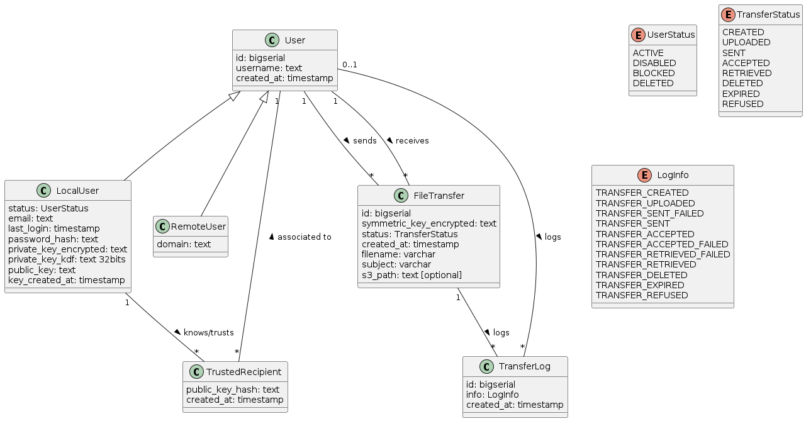

# Database

## Schema

### Definitions
* local transfer: transfer from one local user to another
* orphaned row: row not referenced from anywhere 

### key considerations
* a user may receive a transfer from another user he doesn't know or trust yet.
* various user may trust another user, but not with the same associated public key.
* when a local user rotate it's keys, the owned public key hash is changed but the previous one is kept until orphaned 

#### Transfer situations

##### Sender is local destination is remote
* when the transfer is initiated, the transfer is created in DB with the status PENDING_RETRIEVAL
* when the transfer is retrieved from the remote, the file is removed and the status change to RETRIEVED
* if the sender delete the transfer in any status, the row is deleted
##### Sender is remote destination is local
* when the notification is received, the transfer is created in DB with the status PENDING_RETRIEVAL
* when the receiver ask to retrieve the file and the process complete successfully, the status become RETRIEVED 
  * if it fail, the status stay PENDING_RETRIEVAL
* if the receiver delete the transfer in any status, the row is deleted

##### Sender is local destination is local
* how to manage the deletion of a transfer per one user in the different state ? 

### required integrity constraint
* a public key hash must at least be owned by a local user or associated with a user
* a user can either be local or remote
* a transfer must be associated to at least one owned public key hash at all time
